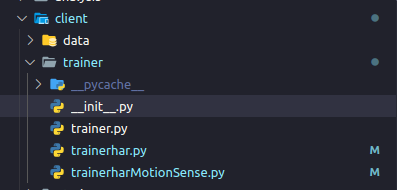
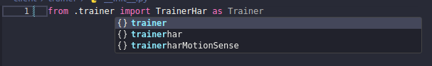
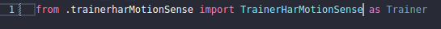
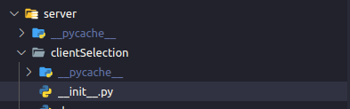
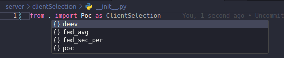

# Cliente

### Como alterar entre os trainers

No cliente fornecido junto ao MininetFed, uma das funcionalidades é poder escolher entre os Trainers fornecidos de exemplo ou implementar um Trainer para os seus próprios experimentos.

Para alternar entre os trainers, acesse o arquivo \_\_init**.py no caminho **client/trainer\_\_.

Nesse arquivo, edite o nome do arquivo do qual se deseja importar o Trainer e o nome da Classe implementada.

Observações importantes: Não altere o **as Trainer**. Ele garante que, para qualquer Trainer escolhido, demais componentes do cliente reconheçam adequadamente o Trainer.

Note também que, da forma que foi demonstrada, novos Trainers implementados devem estar contidos na pasta /client/trainer

### Como implementar um trainer

# Server

### Como alterar entre funções de seleção de clientes

No server fornecido junto ao MininetFed, umas das funcionalidades é alterar entre as funções de seleção de clientes deixadas como exemplo ou implementar novas.

As funções de seleção de clientes são todas encapsuladas em uma Classe.

Para alterar entre as funções de seleção de cliente, acesse o arquivo \_\_init**.py no caminho **server/clientSelection\_\_.

Nesse arquivo, edite o nome do arquivo do qual se deseja importar a função e o nome da Classe implementada.

Observações importantes: Não altere o **as ClientSelection**. Ele garante que, para qualquer função escolhida, demais componentes do server reconheçam adequadamente essa função.

Note também que, da forma que foi demonstrada, novas funções implementados devem estar encapsuladas em uma Classe e contidas na pasta /server/clientSelection

### Como implementar novas funções de seleção de cliente
